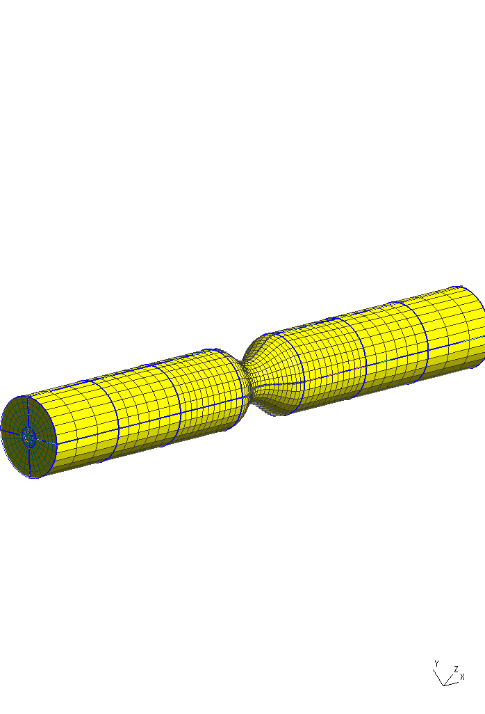

This example is adapted from the 2D case in the [OpenFoamWikki] into a 3D geometry.

[OpenFoamWikki]: https://openfoamwiki.net/index.php/2D_Mesh_Tutorial_using_GMSH

# Figures

# Bibliography

Varghese, S. S., Frankel, S. H., Fischer, P. F., 'Direct numerical simulation of steotic flows. Part 1. Steady flow', Journal of Fluid Mechanics, vol. 582, pp. 253 - 280

